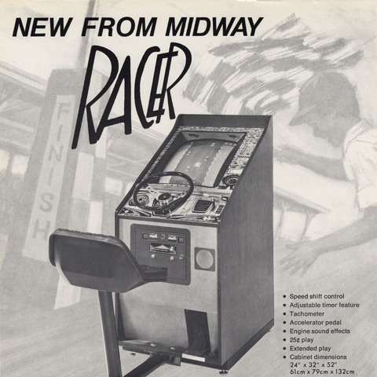
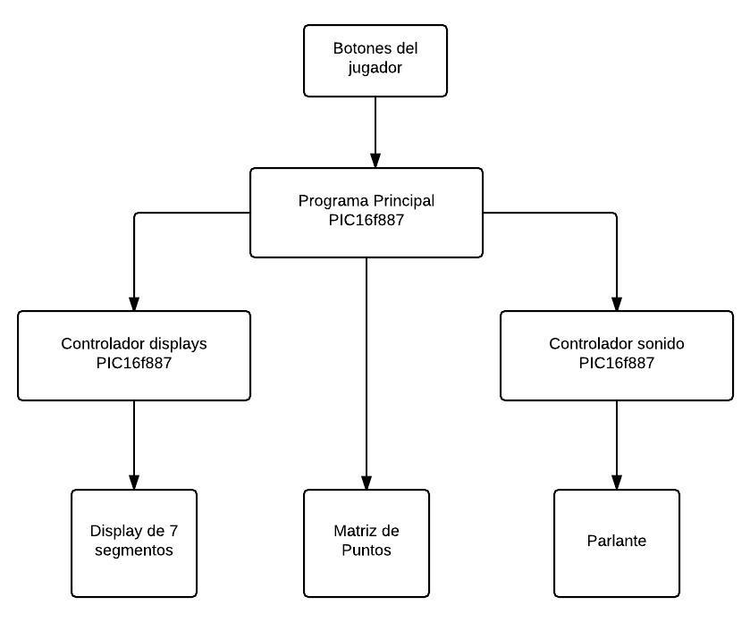
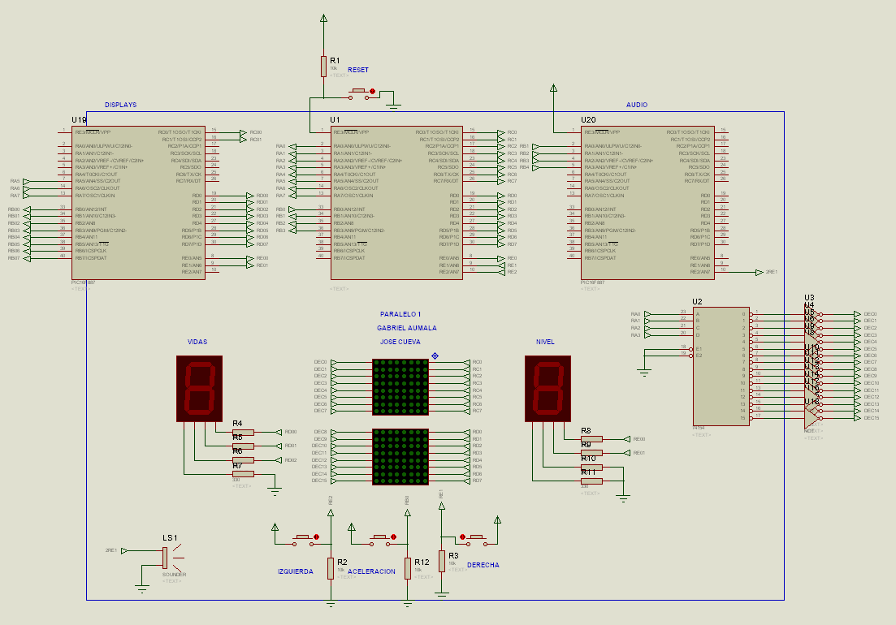

## Enunciado del Programa

Este proyecto es una implementación del popular juego de
video **Racer** en lenguaje ensamblador con microcontroladores PIC16F887.

El juego consiste en controlar un pequeño vehículo en una pista de dos carriles
esquivando los demás vehículos. Si el jugador toca algún otro vehículo
automáticamente pierde una vida. El juego empieza con un máximo de cinco vidas.
Mientras más vehículos esquiva, la dificultad del juego va incrementando. 

El hardware del juego consiste en 3 microcontroladores PIC16F887, 3 botones, 2
displays de 7 segmentos y un parlante. Existe un pic principal que controla a 
los otros dos, además de las matrices de puntos. Los otros dos tienen tareas más
específicas, controlar los displays y el parlante. 

El programa principal periódicamente cambia la imagen mostrada en la matriz de
puntos en base a: el estado actual del juego y los botones que presiona el
jugador. A través de interrupciones, durante ciertos eventos, se activan los
otros pic para generar effectos de sonido y cambiar los valores mostrados en los
display.

## Diagrama de Bloques

## Diagrama de Flujo

## Descripción del algoritmo o estrategia utilizada

## Programa del PIC16F887

## Conclusiones

- En proyectos de mayor complejidad, usar más de un pic ayuda bastante a dividir
  el problema en varios problemas pequeños y poder manejar un mayor nivel de
  abstracción. Esto facilita significativamente el mantenimiento del código
  fuente del programa.
- El PIC16F887 tiene un poder de procesamiento más que suficiente para correr
  videojuegos de la década de 1970. Los videojuegos escritos en lenguaje
  de ensamblador fácilmente entran en la memoria ROM del pic. La frecuencia del
  pic es lo suficientemente rápida para leer entradas y pintar una matriz de
  puntos, incluso con los videojuegos de alta velocidad.
- El TIMER0 es efectivo para generar ondas de sonido para un parlante.
  Modificando los 8 bits de frecuencia con la que cambia el estado del bit de 
  salida pueden representar por lo menos dos octavas de notas musicales, lo cual
  es más que suficiente para melodías cortas y memorables, características de un
  videojuego.

## Recomendaciones

- En Proteus, siempre hay que revisar que los botones no se mantengan en estadio
  presionado. Uno siempre asume que al iniciar la simulación, el botón esta en
  estado abierto, pero a veces no es así, lo cual lleva a errores cuya causa 
  es difícil de detectar ya que no tiene nada que ver con la programación del 
  PIC.
- Los proyectos elaborados en Proteus 8, no pueden ser abiertos en Proteus 7. Al
  colaborar con varias personas, es necesario primero que todos se pongan de
  acuerdo en la versión de Proteus a usar.
- En MPLAB, es bueno prestar atención al log que se genera al compilar. En el
  log se pueden encontrar los comandos que corre MPLAB para compilar y enlazar
  el programa resultante. Si estos comandos son copiados a un script, se puede
  compilar el programa desde una terminal con mayor rapidez que usando la
  interfaz gráfica de MPLAB.
  
  
